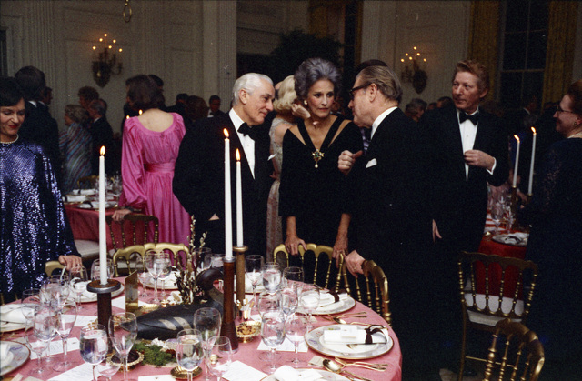
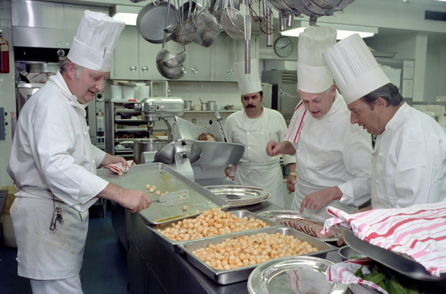

# Kitchen and Dining Room

Imagine you run a classical restaurant. Regardless of the type of food you are serving (whether it is classical Polish *schabowy* or Italian pasta), it should consist of at least two rooms: a dining room, where your customers place orders and later eat your delicious dish. Another room is the kitchen, where the cooks run here and there preparing these meals. Unless your restaurant is a modern hipster place, where the food is prepared in front of the customers (it is not, as you cannot afford for elegant dress for your cooks), the *kitchen* should be separated from the *dining room*! This way, your customers can enjoy their meals without constant noise of buzzing pots.

What is not less important, such separation allows to use the same kitchen to prepare take-away meals.

**The same should be the case with your future programs!**

In the previous section, you have learned about algorithms that have some *input* (your customers' order) nad some *output* (the dish you serve once prepared). Parts of your (or any) program that are responsible for getting this input and providing the output are called **user interface** of a **front-end**. This is the dining room.

On the other hand, the parts of the program that process provided data internally and create the result to be served by the front-end as an output are called **back-end** or **logic**. This is what you find in a kitchen.

Depending on the type of the program, the front-end or back-end part may be dominant. For data analysis and numerical simulation code, you should probably focus more on the back-end. On the other hand, when writing a computer game, the front-end may be more important and more sophisticated.

Very often you will start writing your program with very simple text-based user interface and later, after you make sure the logic part works well, you create some graphical interface that will be easier to use for the end user. In such case, it is crucial that you separate front-end from the back-end from the very beginning.

| Dining room                                                    | Kitchen                 |
| -------------------------------------------------------------- | ----------------------- |
|                                 |  |
| image source: [U.S. National Archives](https://nara.getarchive.net/)                     |

Published under [Creative Commons Attribution-NonCommercial-ShareAlike](https://creativecommons.org/licenses/by-nc-sa/4.0/) license.
