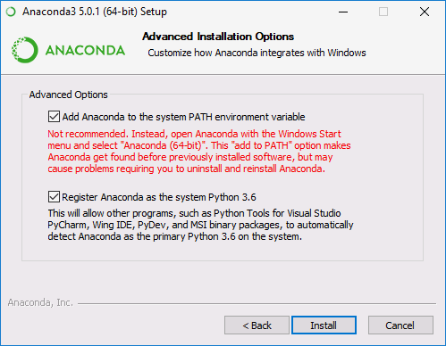

# Installation

As described in the introduction, the Python compiler can be downloaded and installed directly from python.org. However, it will then be necessary to manually install the required libraries for engineering and scientific calculations. Hence, this way is not recommended. Please follow the instructions below, depending on your operating system:

## Linux

In every Linux distribution Python is installed by default. Just make sure you have a proper package with Python 3 installed (e.g. in Ubuntu this is `python3`). You will also need some additional libraries: NumPy, SciPy, Matplotlib, and Pandas (`python3-numpy`, `python3-scipy`, `python3-matplotlib`, `python3-pandas`).

## Windows

In Windows, the simplest solution is to install [Anaconda](https://www.anaconda.com/distribution/) environment, which already includes all the necessary libraries and a set of additional tools. Go to <https://www.anaconda.com/products/individual#Downloads> and download **Python 3.9**.

After downloading the installer, run it. You can leave the default settings. However, I suggest that during installation you make sure that the **All users** and **Register Anaconda as the system Python 3.9** options are checked. I also suggest to check **Add Anaconda to the system PATH environment variable** (ignore the installer warning). It will save some problems in the future...

After successful installation, new items will appear in the Start menu:

Published under [Creative Commons Attribution-NonCommercial-ShareAlike](https://creativecommons.org/licenses/by-nc-sa/4.0/) license.
