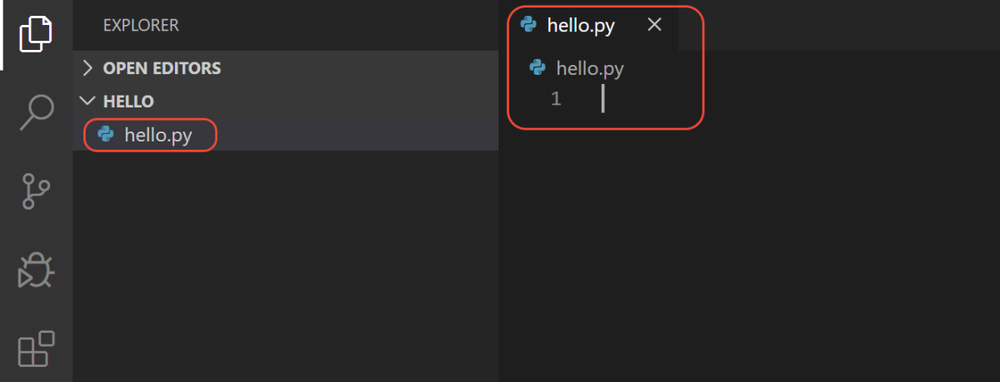
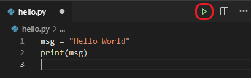

# Programming Environment

You can write your Python programs in a Notepad or any text file editor. However, I strongly discourage to do so. It is much better, to use some programming environment. There is plenty of such environments that you can use with Python, e.g. Spyder, PyCharm, Visual Studio, Visual Studio Code...

## VS Code

You you do not have any familiar editor, I recommend [Visual Studio Code](https://code.visualstudio.com/) (VS Code), that is free and works in any operating system (Windows, Linux, Mac). You can download it from <https://code.visualstudio.com/Download>.

Once you have installed VS Code, you need to install the [Python extension for VS Code](https://marketplace.visualstudio.com/items?itemName=ms-python.python) from the Visual Studio Marketplace. For additional details on installing extensions, see [Extension Marketplace](https://code.visualstudio.com/docs/editor/extension-marketplace). The Python extension is named Python and it's published by Microsoft.

### Start VS Code in a project (workspace) folder

Using a command prompt or terminal, create an empty folder called ‘`hello`’, navigate into it, and open VS Code (`code`) in that folder (.) by entering the following commands:

```
mkdir hello
cd hello
code .
```

By starting VS Code in a folder, that folder becomes your “workspace”. VS Code stores settings that are specific to that workspace in `.vscode/settings.json`, which are separate from user settings that are stored globally.

Alternately, you can run VS Code through the operating system UI, then use **`File` > `Open Folder`** to open the project folder.

### Select a Python interpreter

Python is an interpreted language, and in order to run Python code and get Python help (called IntelliSense in the VS Code), you must tell VS Code which interpreter to use.

From within VS Code, select a Python 3 interpreter by opening the **Command Palette** (`Ctrl+Shift+P`), start typing the **`Python: Select Interpreter`** command to search, then select the command. You can also use the **`Select Python Environment`** option on the Status Bar if available (it may already show a selected interpreter, too):


The command presents a list of available interpreters that VS Code can find automatically. If you don't see the desired interpreter, see VS Code manual on [Configuring Python environments](https://code.visualstudio.com/docs/python/environments).

Selecting an interpreter sets which interpreter will be used by the Python extension for that workspace.

### Create a Python Hello World source code file

From the File Explorer toolbar, select the **New File** button on the `hello` folder:


Name the file `hello.py`, and it automatically opens in the editor:



By using the `.py` file extension, you tell VS Code to interpret this file as a Python program, so that it evaluates the contents with the Python extension and the selected interpreter.

> **Note:** The File Explorer toolbar also allows you to create folders within your workspace to better organize your code.
> You can use the **New folder** button to quickly create a folder.

Now that you have a code file in your Workspace, enter the following source code in `hello.py`:

```python
msg = "Hello World"
print(msg)
```

When you start typing print, notice how IntelliSense presents auto-completion options.


### Run Hello World

It's simple to run `hello.py` with Python. Just click the **Run Python File in Terminal** play button in the top-right side of the editor.



The button opens a terminal panel in which your Python interpreter is automatically activated, then runs `python3 hello.py` (macOS/Linux) or `python hello.py` (Windows):


There are three other ways you can run Python code within VS Code:

* Right-click anywhere in the editor window and select **`Run Python File in Terminal`** (which saves the file automatically):

  

* Select one or more lines, then press `Shift+Enter` or right-click and select **`Run Selection/Line in Python Terminal`**. This command is convenient for testing just a part of a file.

* From the Command Palette (`Ctrl+Shift+P`), select the Python: **`Start REPL`** command to open a REPL terminal for the currently selected Python interpreter. In the REPL, you can then enter and run lines of code one at a time.


<hr/>

Published under [Creative Commons Attribution-NonCommercial-ShareAlike](https://creativecommons.org/licenses/by-nc-sa/4.0/) license.  
Source: <https://code.visualstudio.com/docs/python/python-tutorial>
