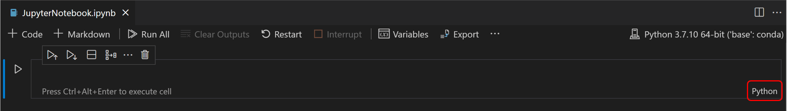

# Fast prototyping with Jupyter Notebooks

## What is Jupyter?

Jupyter is an open-source project that lets you easily combine [Markdown](https://en.wikipedia.org/wiki/Markdown) text and executable Python source code on one canvas called a **notebook**. It can contain: input and output of code, formatted text, images, videos, pretty math equations, and much more. The computer code is executable, which means that you can run the bits of code, right in the document, and get the output of that code displayed for you. This interactive way of computing, mixed with the multi-media narrative, allows you to tell a story (even to yourself) with extra powers!

You can start jupyter using a command line and interact with it in a web browser. Alternatively, you may directly create, view and edit notebooks in VS Code.

## Creating a notebook in VSCode

You can create a Jupyter Notebook by running the **Jupyter: Create Blank New Jupyter Notebook** command from the Command Palette (`Ctrl+Shift+P`) or by creating a new `.ipynb` file in your workspace.


Next, select a kernel using the kernel picker in the top right.


If you have an existing Jupyter Notebook, you can open it by right-clicking on the file and opening with VS Code, or through the VS Code File Explorer.

## Notebook cells

The Jupyter notebook uses *cells*: blocks that divide chunks of text and code. Any text content is entered in a *Markdown* cell: it contains text that you can format using simple markers to get headings, bold, italic, bullet points, hyperlinks, and more.

Markdown is easy to learn, check out the syntax in the ["Daring Fireball"](https://daringfireball.net/projects/markdown/syntax) webpage (by John Gruber). A few tips:

* to create a title, use a hash to start the line: `# Title`
* to create the next heading, use two hashes (and so on): `## Heading`
* to italicize a word or phrase, enclose it in asterisks (or underdashes): `*italic*` or `_italic_`
* to make it bold, enclose it with two asterisks: `**bolded**`
* to make a hyperlink, use square and round brackets: `[hyperlinked text](url)`

Computable content is entered in code cells. We will be using the IPython kernel ("kernel" is the name used for the computing engine), but you should know that Jupyter can be used with many different computing languages. It's amazing.

A code cell will show you an input mark, like this:

`In [ ]:`

Once you add some code and execute it, Jupyter will add a number ID to the input cell, and produce an output marked like this:

`Out [1]:`

### Running cells

Once you have a Notebook, you can run a code cell using the **Run** icon to the left of the cell and the output will appear directly below the code cell.

You can also use keyboard shortcuts to run code. When in command or edit mode, use `Ctrl+Enter` to run the current cell or `Shift+Enter` to run the current cell and advance to the next.


You can run multiple cells by using **Run All**, **Run All Above**, or **Run All Below**.

### Code cell modes

While working with code cells, a cell can be in three states: unselected, command mode, and edit mode. The current state of a cell is indicated by a vertical bar to the left of a code cell and editor border. When no bar is visible, the cell is unselected.

When a cell is selected, it can be in two different modes. It can be in command mode or in edit mode. When the cell is in command mode, it can be operated on and accept keyboard commands. This mode is indicated by a a solid vertical bar to the left of the cell.

When the cell is in edit mode, the solid vertical bar is joined by a border around the cell editor. In this mode, the cell's contents (code or Markdown) can be modified.

To move from edit mode to command mode, press the `Esc` key. To move from command mode to edit mode, press the `Enter` key. You can also use the mouse to **change the mode** by clicking the vertical bar to the left of the cell or out of the code/Markdown region in the code cell.

### Switch between code and Markdown

The Notebook Editor allows you to easily change code cells between Markdown and code. Clicking the language picker in the bottom right of a cell will allow you to switch between Markdown and, if applicable, any other language supported by the selected kernel.



You can also use the keyboard to change the cell type. When a cell is selected and in command mode, the `M` key switches the cell type to Markdown and the `Y` key switches the cell type to code.

Once Markdown is set, you can enter Markdown formatted content to the code cell.


To render Markdown cells, you can select the check mark in the cell toolbar, or use the `Ctrl+Enter` and `Shift+Enter` keyboard shortcuts.


## Variable Explorer and Data Viewer

Within a Python Notebook, it's possible to view, inspect, sort, and filter the variables within your current Jupyter session. By selecting the **Variables** icon in the main toolbar after running code and cells, you'll see a list of the current variables, which will automatically update as variables are used in code. The variables pane will open at the bottom of the notebook.


## Interactive computing in the notebook

You can test-drive a code cell by writing some arithmetic operations. The Python operators are:

| Operator | Meaning                             |
| -------- | ----------------------------------- |
| `+`      | addition                            |
| `-`      | subtraction                         |
| `*`      | multiplication                      |
| `/`      | division                            |
| `**`     | exponent (`3**2` means 3²)          |
| `%`      | modulo (division remaidner)         |
| `//`     | floor division (without a remained) |

Create a new Python code cell and type:

```python
1 + 2
```

Next, press `Shift+Enter`. What do you see? Try other calculations, including more complex ones, like:

```python
2 + 2 * 2
```

or

```python
9**1/2
```

What is the result of the last operation? Why is it `4.5`? Isn't 9 to the power 1/2 just a square root of 9 i.e. 3? Compare with this:

```python
9**(1/2)
```

You see, Python knows about [Arithmetics/Order of operations](https://en.wikibooks.org/wiki/Arithmetic/Order_of_Operations).


## Exercises

Use Jupyter notebooks (as a calculator) to solve the following two problems:

1. The volume of a sphere with radius *r* is 4/3 *π* *r*³. What is the volume of a sphere with diameter 6.65 cm?
   For the value of *π* use 3.1415926 (for now).

2. Suppose the cover price of a book is 24.95 EUR, but bookstores get a 40% discount.
   Shipping costs 3 EUR for the first copy and 75 cents for each additional copy.
   What is the total wholesale cost for 60 copies?


<hr/>

Published under [Creative Commons Attribution-NonCommercial-ShareAlike](https://creativecommons.org/licenses/by-nc-sa/4.0/) license.

Based on a [lecture by Loreena Barba](https://github.com/engineersCode/EngComp1_offtheground) and VS Code documentation at <https://code.visualstudio.com/docs/datascience/jupyter-notebooks>.
