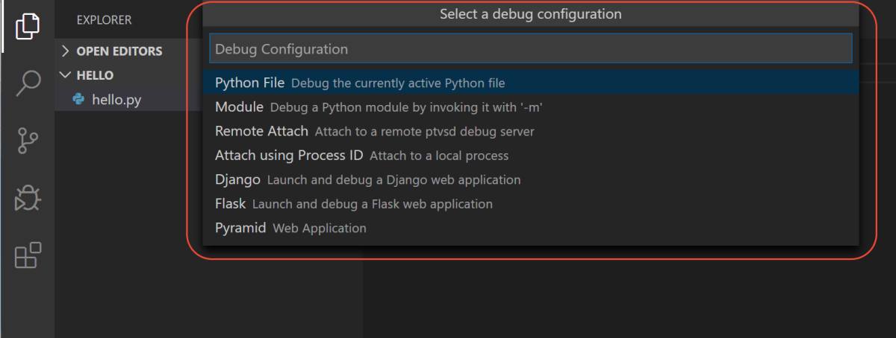
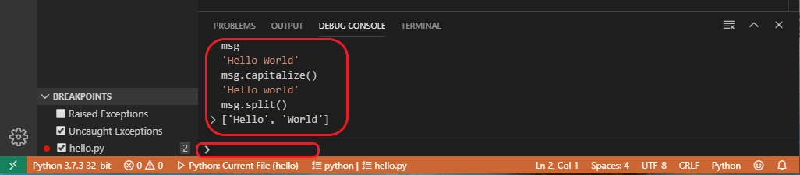

# Debugging your code

A debugger is a computer program used to test and debug other programs (in our case Python scripts). The main use of a debugger is to run the target program under controlled conditions that permit the programmer to track its operations in progress and monitor changes in computer resources (most often memory areas used by the target program or the computer's operating system) that may indicate malfunctioning code. Typical debugging facilities include the ability to run or halt the target program at specific points and display its state.

The terms “bug” and “debugging” are popularly attributed to Admiral Grace Hopper in the 1940s. While she was working on a Mark II computer at Harvard University, her associates discovered a moth stuck in a relay and thereby impeding operation, whereupon she remarked that they were “debugging” the system.

  
<span style="font-size: 80%">Source: U.S. Naval Historical Center Online Library Photograph NH 96566-KN</span>

## Configure and run the debugger in VS Code

Let's now try debugging our simple Hello World program.

First, set a breakpoint on line 2 of `hello.py` by placing the cursor on the print call and pressing `F9`. Alternately, just click in the editor's left gutter, next to the line numbers. When you set a breakpoint, a red circle appears in the gutter.


Next, to initialize the debugger, press `F5`. Since this is your first time debugging this file, a configuration menu will open from the Command Palette allowing you to select the type of debug configuration you would like for the opened file.



For now, just select *`Python File`*, which is the configuration that runs the current file shown in the editor using the currently selected Python interpreter.

The debugger will stop at the first line of the file breakpoint. The current line is indicated with a yellow arrow in the left margin. If you examine the **Local** variables window at this point, you will see now defined `msg` variable appears in the Local pane.


A debug toolbar appears along the top with the following commands from left to right: continue (`F5`), step over (`F10`), step into (`F11`), step out (`Shift+F11`), restart (`Ctrl+Shift+F5`), and stop (`Shift+F5`).


The Status Bar also changes color (orange in many themes) to indicate that you're in debug mode. The *Python Debug Console* also appears automatically in the lower right panel to show the commands being run, along with the program output.

To continue running the program, select the continue command on the debug toolbar (`F5`). The debugger runs the program to the end.

> **Tip:** Debugging information can also be seen by hovering over code, such as variables. In the case of `msg`, hovering over the variable will display the string `Hello world` in a box above the variable.

You can also work with variables in the Debug Console (If you don't see it, select **Debug Console** in the lower right area of VS Code, or select it from the **...** menu.) Then try entering the following lines, one by one, at the **>** prompt at the bottom of the console:

```python
msg
msg.capitalize()
msg.split()
```



Select the blue **Continue** button on the toolbar again (or press `F5`) to run the program to completion. “Hello World” appears in the Python Debug Console if you switch back to it, and VS Code exits debugging mode once the program is complete.

If you restart the debugger, the debugger again stops on the first breakpoint.

To stop running a program before it's complete, use the red square stop button on the debug toolbar (`Shift+F5`), or use the **`Run` > `Stop`** debugging menu command.

> You should use the debugger often to understand how your code works and what operations are executed. Later, use it for finding errors in your code. Remember that this is normal that every program has many bugs in the beginning. An important part of the programming skill is ability to find them and fix them.


<hr/>

Published under [Creative Commons Attribution-NonCommercial-ShareAlike](https://creativecommons.org/licenses/by-nc-sa/4.0/) license.  
Source: <https://code.visualstudio.com/docs/python/python-tutorial>
