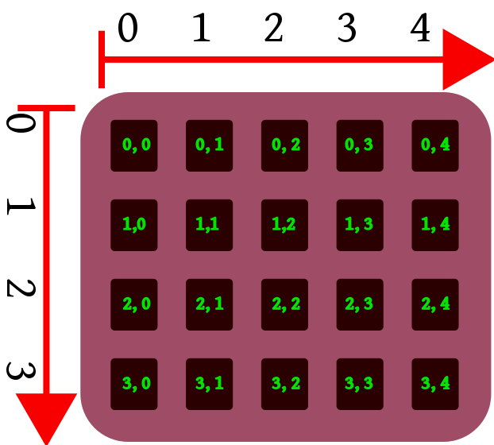

# NumPy: numeric arrays and calculations

## NumPy Package

The [NumPy](http://numpy.scipy.org/) module is the basic toolset for Python enabling advanced mathematical calculations, especially for scientific applications (so-called _numerical calculations_, such as matrix multiplication and addition, diagonalization and inversion, integration, equation solving, etc.). It gives us specialized data types, operations and functions that are not available in a typical Python installation. Another module, [Scipy](http://scipy.org/) allows access to more complex and diverse scientific algorithms using the tools provided by NumPy.

We will only provide an introduction to NumPy here. This is because describing the numerous features available in the NumPy library is a huge piece of work that makes no sense at all: you might as well have a look directly at its original documentation at <http://docs.scipy.org/doc/numpy/reference/>.

The most important variable type, which NumPy and other packages that use it rely is the `ndarray` class, often referred to as `array`. We can treat `array` objects as universal containers for data in the form of _matrices_ (i.e. _vectors_ or _arrays_). Compared to the standard types of Python sequences (`list`, `tuple`), there are a few differences in handling these objects:

1. the objects stored in the `array` must all be of the same type;
2. `array` objects keep their size; when such an object is resized, a new object is created and the original object is deleted;
3. `array` objects are equipped with a rich set of functions operating on all data stored in the object, specially optimized for processing large amounts of data. How it works will be presented below.


## Creating arrays

The easiest way to create a NumPy array is to call the function `array` with a list of numbers as an argument. If, instead of a list of numbers, we use a list containing other lists (so-called _nested list_), we will get a multidimensional array. For example, if the lists are double-nested, we get a two-dimensional array (_matrix_).

For example:

```python
import numpy as np  # np is a popular alias for numpy
A = np.array([ 1, 3, 7, 2, 8])
B = np.array([[1, 2, 3], [4, 5, 6]])
print(A, end='\n\n')
print(B, end='\n\n')
print(B.transpose())
```

The result will be:

```
[1 3 7 2 8]

[[1 2 3]
 [4 5 6]]

[[1 4]
 [2 5]
 [3 6]]
```

Another way to create an array is with a function `arange`, which works like a `range` function except that it returns the NumPy array instead of a list, and allows fractional parameters — not just integers.

The arguments are the same as for the `range` function:

1. starting index [optional, default 0]
2. index next to final
3. step [optional, default 1]

```python
print(np.arange(1000000))
print(np.arange(0.1, 0.2, 0.01))
print(np.arange(0.9, 0.0, -0.1))
```

```
[     0      1      2 ... 999997 999998 999999]
[0.1  0.11 0.12 0.13 0.14 0.15 0.16 0.17 0.18 0.19]
[0.9 0.8 0.7 0.6 0.5 0.4 0.3 0.2 0.1]
```

As already mentioned, in case of an `array`, we can perform mathematical operations on all elements of the array using one operator or function. This behavior is different than that of lists and other Python sequences. For example, if we wanted to multiply all the elements of a list `L` by a number `a`, we would need to loop:

```python
L =  [1, 3, 5, 2, 3, 1]
for i, x in enumerate(L):
    L[i]  = a * x
```

You can also write it more succinctly using a generator expression:

```python
L =  [1, 3, 5, 2, 3, 1]
L =  [a * x for x in L]     # unlike the loop version, here L will be replaced by a new list
L[::] = [a * x for x in L]  # a this will keep the identity of the L list, just like the loop version
```

however, this is still just a simplified notation of a loop. On the other hand, multiplying all the elements of an array `M` by a number  `a` looks like this:

```python
M = np.array([1, 3, 5, 2, 3, 1])
M = a * M
```

or even simpler (keeping the identity of `M`):

```python
M *= a
```

Operations performed at once on entire matrices have many advantages. The program code is simpler and shorter, making it less error-prone. In addition, we do not have to worry about the specific implementation of a given operation: it is done for us by NumPy, which is specially optimized to make it work as quickly as possible.

Check some other methods of creating arrays: [linspace](http://docs.scipy.org/doc/numpy/reference/generated/numpy.linspace.html), [zeros](http://docs.scipy.org/doc/numpy/reference/generated/numpy.zeros.html), [ones](http://docs.scipy.org/doc/numpy/reference/generated/numpy.ones.html), [eye](http://docs.scipy.org/doc/numpy/reference/generated/numpy.eye.html), [meshgrid](http://docs.scipy.org/doc/numpy/reference/generated/numpy.meshgrid.html).


## Array shape

As you may have noticed, NumPy arrays can have a different number of dimensions:

* a one-dimensional array `A` is an equivalent of a vector, its elements `A[k]` are numbered with the value of a single index (pointer), ranging from `0` to `len(A) - 1` - similar to a list in “normal” Python
* a two-dimensional array, say `M`, is the equivalent of a matrix with elements `M[k,l]`; if `k = 0, ...K`, `l = 0, ...L`, then it has `K * L` elements
* in general, to describe a _shape_ of a NumPy array, a tuple of positive integers is given describing the range of values ​​of its individual indices (and the number of elements of the tuple is, of course, the number of array dimensions). This tuple can be read using the attribute `M.shape`:

```python
M = np.array([[0.61064052, 0.51970673, 0.06353282],
              [0.50159111, 0.83545043, 0.10928144]])
print(M.shape)
```

```
(2,  3)
```

The shape of a one-dimensional array is obviously a one-element tuple (and not a single number) i.e. `(n,)`.

**Note:** The function `len(A)` applied to the NumPy array `A` will only return the number of possible values ​​for the first index, not the number of elements in the array. The number of array elements is given by the attribute `A.size`.

A series of functions creating new arrays takes the shape of the array that is to be created (i.e. a tuple of natural numbers) as an argument (or one of the arguments), e.g. `numpy.zeros(shape)` and `numpy.ones(shape)` create an array of zeros or ones of any given shape, respectively. There are also operations to get a reshaped array, filled with data from an existing array:

```python
M.reshape((3,  2))
# array([[0.61064052, 0.51970673],
#        [0.06353282, 0.50159111],
#        [0.83545043, 0.10928144]]))

M.reshape((6,))
# array([0.61064052, 0.51970673, 0.06353282, 0.50159111, 0.83545043, 0.10928144])
```

instead of the latter, you can use  the “flatten” operation `M.flatten()`.

**Note:** The  dimensions of the array before and after the conversion (i.e. the number of elements) must match.

You can also assign a new value to the attribute `shape`:

```python
M.shape = (2, 3)
# array([[0.61064052, 0.51970673, 0.06353282],
#        [0.50159111, 0.83545043, 0.10928144]])
```

but then we change the shape of the existing array. Naturally, also in this case the sizes (original and after reshaping) must match.


## Arrays as views of the data

In Python, operations with mutable types (for example, lists that can change their content while retaining their identity) can either change the content of an object, or create a new object with content based on the original content. If _the same object_ appears under different names, then all such instances are identical. In NumPy it is a bit different: arrays transformed in various ways (e.g. by an operation `reshape()`) often turn out to be different views (for Python they are **different objects**) of **the same data**. For example:


```python
A = np.arange(24)
print(A)
# [ 0  1  2  3  4  5  6  7  8  9 10 11 12 13 14 15 16 17 18 19 20 21 22 23]

B = A.reshape(6, 4)
print(B)
# [[ 0  1  2  3]
#  [ 4  5  6  7]
#  [ 8  9 10 11]
#  [12 13 14 15]
#  [16 17 18 19]
#  [20 21 22 23]]

A[-1] = 0
print(B)
# [[ 0  1  2  3]
#  [ 4  5  6  7]
#  [ 8  9 10 11]
#  [12 13 14 15]
#  [16 17 18 19]
#  [20 21 22  0]]

print(A is B)    # False
print(A == B)    # False
```

We changed an element of array `A`, but the corresponding element or array `B` changed as well, although we did not perform any operation on it, and it is of a different shape than `A`. For Python these two arrays are different, although they share the same data.

This behavior results (among others) from the desire to optimize: NumPy is designed to operate on rather large arrays of data, so attempts are made to avoid unnecessary copying of data between arrays (which wastes memory and other system resources). However, it should be remembered that if we need a table that is really independent of the original, containing the same (or derivative) data, then it is better  to copy this data explicitly (e.g. with a function `numpy.copy`). You should carefully read the documentation of the functions and methods you use, especially as the rules governing whether we are dealing with a copy of the data or a new view are not very consistent.

## Data extraction



### Single numbers

Elements (and sub-arrays) of one-dimensional arrays can be accessed exactly the the same way as in case of lists i.e. by using index (`data[i]`) and slice (`data[i:j]`).

For multi-dimensional arrays, you should give a number of indices or slices (separated by comma) equal to the number of array dimensions:

Access to a single item:

```python
A =  np.array([[1, 2, 3], [4, 5, 6]])
print(A)
# [[1 2 3]
#  [4 5 6]]

print(A[0, 2])  # 3
```

The matrix  A is a two-dimensional array, and the objects it contains are numbered as follows: the first index runs along the first dimension (selects a row), the second index runs along the second dimension (selects a column).

### Sub-arrays

Access to sub-arrays:

```python
print(A[1])              # 1 line
# [4 5 6]

print(A[1, :])           # line 1, all columns of
# [4 5 6]

print(A[:, 1])           # all lines, column 1
# [2 5]
```

As you can see, limiting yourself to a single point in a given dimension causes that dimension to degenerate. The result is an array in which the number of dimensions is less by one.

```python
print(A[:, 1:])
# [[2 3]
#  [5 6]]
```

In the first dimension (lines) we take everything, while in the second dimension, we take everything from 1 to the end. We effectively cut column 0.

### Indexing arrays with arrays

You can also use another array to select items from an array. It could be

* array of numbers: then they are treated as indices. We choose those elements that would be obtained by indexing each index separately
* array of `bool` values, which has the same size as the indexed data: We select those elements to which it the corresponding value of the indexing `bool` array is `True`.

**Note:** The result is a one-dimensional array.

Example:

```python
print(A)
# [[1 2 3]
#  [4 5 6]]

print(A >  2)
# [[False False  True]
#  [ True  True  True]]

print(A[A > 2])
# [3  4  5  6]

print(A[A % 2 == 0])
[2 4 6]
```

More: <http://docs.scipy.org/doc/numpy/user/basics.indexing.html>


## Data operations in NumPy tables

### Arithmetic

To allow convenient handling of data contained in NumPy arrays, the basic arithmetic operations of NumPy are extended to cover the contents of the array without (usually) writing any loops. For example, you can multiply an array by a number, add a number to it, and so on, and this will affect all the elements of the array:

```python
M = np.arange(24).reshape((4, 6)) * 2 + 1
print(M)
# [[ 1  3  5  7  9 11]
#  [13 15 17 19 21 23]
#  [25 27 29 31 33 35]
#  [37 39 41 43 45 47]]
```

Moreover, you can also perform arithmetic operations on two (and more) arrays:

```python
N = 1 / M
print(N)
# [[1.         0.33333333 0.2        0.14285714 0.11111111 0.09090909]
#  [0.07692308 0.06666667 0.05882353 0.05263158 0.04761905 0.04347826]
#  [0.04       0.03703704 0.03448276 0.03225806 0.03030303 0.02857143]
#  [0.02702703 0.02564103 0.02439024 0.02325581 0.02222222 0.0212766 ]]

print(N * M)
# [[1. 1. 1. 1. 1. 1.]
#  [1. 1. 1. 1. 1. 1.]
#  [1. 1. 1. 1. 1. 1.]
#  [1. 1. 1. 1. 1. 1.]]
```

So, for example, arrays of compatible shapes can be added together, multiplied, etc., and these operations will be performed in pairs on all elements.

**Note:** this is not quite an implementation of the defined mathematics of arithmetic operations on vectors, matrices, etc. In particular, in mathematics, [matrix multiplication](https://en.wikipedia.org/wiki/Matrix_multiplication) does not mean multiplying elements in pairs! Mathematically correct multiplication can be performed in NumPy using `@` operator:

```python
A = np.array([[1, 2], [3, 4]])
B = np.array([[-4, 2], [3, -1]])

print(A * B)
# [[-4  4]
#  [ 9 -4]]

print(A @ B)
# [[2 0]
#  [0 2]]
```

### Mathematical functions

Moreover, the numpy module contains implementations of basic functions appearing in physical and mathematical formulas, such as  `sin`, `cos`, `exp`, `log` and many others, in a version adapted to operating on table data, also element by element. Even more of these functions are provided by other sub-modules in the NumPy package, and the SciPy (Scientific Python) package. For example:

```python
X = np.arange(0, 2 * np.pi, 0.1)

print(np.sin(X)**2 + np.cos(X)**2)
# [1. 1. 1. 1. 1. 1. 1. 1. 1. 1. 1. 1. 1. 1. 1. 1. 1. 1. 1. 1. 1. 1. 1. 1.
#  1. 1. 1. 1. 1. 1. 1. 1. 1. 1. 1. 1. 1. 1. 1. 1. 1. 1. 1. 1. 1. 1. 1. 1.
#  1. 1. 1. 1. 1. 1. 1. 1. 1. 1. 1. 1. 1. 1. 1.]
```

The above calculation checks the validity of the formula for "trigonometric one" within one period, with a resolution of 0.1 radians.


## Why Use NumPy?

The first, usually the least important, is *performance*. If we are to multiply 100 elements, the speed of operation on a single element does not matter. It is similar with the size of a single element. If the elements are 10<sup>6</sup> , then also the overhead does not matter. Let's count: 1 000 000 times 12 bytes is 12 MB. A typical computer currently has 1-4 GB of memory, so we use 1.2% to 0.27% of the available memory — what's the problem? It is only when the space occupied by the data is in the same order as all available memory that whether a single cell is 8 or 16 bytes begins to matter.

The second reason, which is important for your enjoyment of work, is object-oriented and infix *notation*. The former is of course “dot notation”: access to methods and attributes on the object. Its use, especially in combination with TAB padding, simplifies writing. An example of object notation:

```python
a.transpose().min()
# instead of
numpy.min(numpy.transpose(a))
```

The latter (infix) is the good old “math notation”: the placement of binary operators between the objects they act on. An example of infix notation:

```python
a + b * c
# instead of
numpy.add(a, numpy.multiply(b, c))
```

Of course, object and infix notation is used everywhere in Python, but it's worth mentioning that NumPy does not deviate from it. Nevertheless, NumPy departs from the Python interpretation of some actions. In Python, operations such as multiplying lists are derived from string operations. In numerical computation, operations on elements are the basis, so in NumPy all operators default to individual pairs of elements.

The third reason, and perhaps the most important, is the *library of numeric functions*. Moving away from data objectivity allows you to export values ​​and communicate with libraries written in completely different programming languages. For example, SciPy can use the LAPACK library (Linear Algebra PACKage, written in Fortran 77). The fact that functions written in different languages ​​can exchange data in memory without complicated data translation is due to the fact that, as described in the previous section, all numbers are ultimately in a processor-accepted format.

The ability to use code written in C or Fortran allows the use of old, optimized, proven solutions.


<hr />

Published under [Creative Commons Attribution-NonCommercial-ShareAlike](https://creativecommons.org/licenses/by-nc-sa/4.0/) license.  
Original author Robert J. Budzyński. Source: <https://brain.fuw.edu.pl/edu/index.php/PPy3/NumPy>.