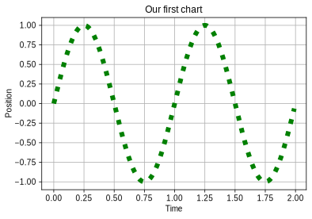
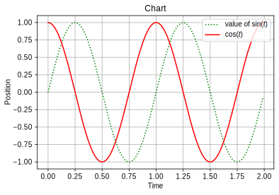
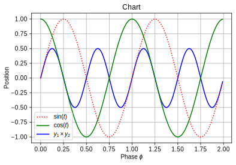
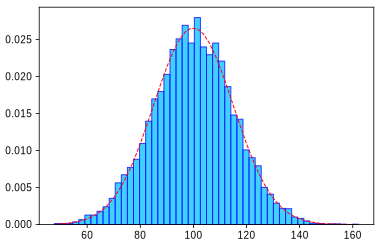
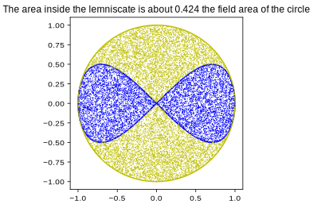

# Matplotlib: data visualization

## Introduction to Matplotlib

The Matplotlib package is based on NumPy. We will show you how to use it to draw various charts graphically presenting analyzed data and calculation results. Instead of listing the contents of the package, we will show some examples. We will start with the simple ones and we will discuss the structures used in them along the way.


## Function plots

Let's follow the operation of the following program:


```python
import matplotlib.pyplot as plt
x = [1, 2, 3]
y = [4, 6, 5]
plt.plot(x, y)
plt.show()
```


How does it work?

To use the Matplotlib graphics package we import it into our program with a command `import`.

The `pyplot` subpackage is one of a few slightly different _interfaces_ to Matplotlib: i.e. ways to use of its functionality. Another, also frequently used, is named `pylab` and can be imported directly (`import pylab`). Pyplot is probably a bit more flexible, although for the simplest examples — the ones we're going to cover here — there is no significant difference.

We produce two lists `x` and `y` containing sequences of numbers 1, 2, 3 and 4, 6, 5.

The function `plot` draws a graph and places points on it with coordinates contained in the lists passed to it as arguments. The first argument contains the horizontal (_x_) coordinates of the successive points, and the second argument the vertical (_y_) coordinates of the successive points on the plot. Since the lists have three items each, the graph will contain three points with the coordinates (1, 4), (2, 6) and (3, 5). By default, the points on the graph are connected with each other by a solid line. This, of course, can be changed: by adding optional parameters to the `plot` function you can get a line of a different color, a dashed line, a line with dots, or no line at all — but, for example, large dots (triangles, stars, etc.) in places corresponding to data points.

After calling the function, the  plot graph does not appear on the screen yet. To show it, we use the functions `show. If you run the code interactively in Visual Studio Code, the graph will be embedded in the output console.  If you run it as a script, the graph appears on the screen in a separate window, and Python waits until the graph window is closed to execute the next instructions.

There are several buttons in the graph window (bottom left). They are used to manipulate the appearance of the drawing. The cross button allows you to decrease/increase the scale on the axes (by pressing the right mouse button and moving the cursor over the image) and moving the entire graph (by pressing the left mouse button and moving the cursor over the image). The button with the window and arrows also allows you to change the size and position of the graph axis inside the window by selecting the appropriate values. The house button restores the original drawing settings. A button with a floppy disk image (does anyone know what it is?) allows to save the graph (its current state, i.e. including the interactively modified modifications) as a graphic file of one of several formats.

Let's draw a graph of the sine function:


```python
import numpy as np
import matplotlib.pyplot as plt
x = np.arange(0.0,  2.0,  0.01)
y = np.sin(2. * np.pi * x)
plt.plot(x, y)
plt.show()
```


How does it work?

In addition to the functions from Matplotlib, we also directly refer to elements from the NumPy package.

A function `arange` is similar to a standard function `range` that produces a certain sequence of numbers as a list. `arange`, instead of a list produces an array containing floating-point numbers that begins with the first argument (in our case 0.0) and ends before the second argument (traditionally, the result string does not contain the value given as the second argument, in our case  2.0). The difference between the elements of the created string is 1 by default, but if we give the third argument, it defines an array step, in our case it is 0.01. So, the variable `x` is a vector array containing a sequence of numbers from 0 to 1.99 every 0.01 (that is, 0, 0.01, 0.02, ..., 1.98, 1.99).

This function `sin` is used to calculate the value of the sine function for the argument given in radians. And what is the argument of this function? It is our array multiplied by 2_π_. As you should recall from the previous lecture, multiplication of a number and an array gives an array. This means that the argument of the function `sin` is not a number but an array! Thus, the variable `y` contains a sequence of values ​​of the sine functions calculated for the values ​​contained in the variable `x` multiplied by 2_π_ each (i.e. sin(2_π_ × 0), sin(2_π_ × 0.01), sin(2_π_ × 0.02), ..., sin(2_π_ × 1.98), sin(2_π_ × 1.99)).

The function `plot(x, y)` draws a set of points with the coordinates (_x_, sin(2_πx_)) connected by a solid line.

Let's improve the chart:


```python
import numpy as np
import matplotlib.pyplot as plt

x = np.arange(0.0, 2.0, 0.01)
y = np.sin(2. * np.pi * x)
plt.plot(x, y, 'g:', linewidth=6)

plt.xlabel('Time')
plt.ylabel('Position')
plt.title('Our first chart')
plt.grid(True)
plt.show()
```





How does it work?

Compared to the previous example, there are some minor changes and "embellishments" in the chart.

In the function  plot there are two new parameters:

* `g:` — this parameter controls the appearance of the drawn plot line. The first letter of this string specifies the color of the line (for example `r` red, `g` green, `b` blue, `y` yellow, `k` black). The second character of the text determines the appearance of the line itself (e.g  `-` continuous, `:` dotted, `o` round points without lines, `+` crosses without lines, etc.).
* `linewidth=6` — this parameter changes the thickness of the drawn line.

We also call functions `xlabel` and `ylabel`. Their arguments are strings that will appear as descriptions for the axis, respectively, horizontal and vertical. The function `title` prints the string passed to it as the title of the entire chart.

The function `grid` draws a rectangular grid on the chart at selected points describing the values ​​on the chart axes. The points where the values ​​described on th  ticks are selected are selected automatically (of course, if we want, we can change their position and descriptions with an appropriate function, we'll talk about it later).


## Several plots in common axes

```python
import numpy as np
import matplotlib.pyplot as plt

x = np.arange(0.0, 2.0,  0.01)
y1 = np.sin(2. * np.pi * x)
y2 = np.cos(2. * np.pi * x)
plt.plot(x, y1 , 'g:', x , y2 , 'r')
plt.legend((r'value of $\sin(t)$' , r'$\cos(t)$'))
plt.xlabel('Time' )
plt.ylabel('Position')
plt.title ('Chart')
plt.grid(True)
plt.show()

```





How does it work?

We can draw many graphs in one coordinate system. We do it by specifying in one command `plot` the sets of parameters describing individual lines: _x_ coordinates, _y_ coordinates, line style. To easily identify lines, you can add a legend using the command `legend()`. To find out control the appearance and location of the legend, please refer to the [documentation](https://matplotlib.org/3.3.2/api/_as_gen/matplotlib.pyplot.legend.html).

In every string (in labels, title, legend, etc.) you can use `$` characters to write mathematical expression using [LaTeX notation](https://matplotlib.org/tutorials/text/mathtext.html) (in such case, you should prepend the string with the `r` prefix, so the character `\` is not interpretted by Python).

Another version:


```python
import numpy as np
import matplotlib.pyplot as plt

x = np.arange(0.0,  2.0,  0.01)
y1 = np.sin(2. * np.pi * x)
y2 = np.cos(2. * np.pi * x)
y = y1 * y2
l1,  = plt.plot(x, y, 'b')
l2, l3 = plt.plot(x, y1, 'r:', x, y2, 'g')
plt.legend((l2, l3, l1), (r'$\sin(t)$' , r'$\cos(t)$', r'$y_1 \times y_2$'))
plt.xlabel(r'Phase $\phi$')
plt.ylabel('Position')
plt.title('Chart')
plt.grid(True)
plt.show()
```





Graphs can be added to the coordinates with subsequent calls to the `plot` function. The function `plot` returns a list of lines. The notation `l1, = plt.plot(x, y, 'b')` extracts the first line from the list (If there was no comma after `l1` it would be a list containing one object of class line).

By naming individual line objects, we can control their order (and presence) on the legend.

## Plotting histogram


```python
import matplotlib.pyplot as plt

counts = [0, 1, 2, 2, 3, 3, 3, 3, 3, 3, 4, 4, 4, 5, 7]
plt.hist(counts, facecolor='#2ab0ff', edgecolor='#169acf')
plt.show()
```


We assign a sequence with manually specified values to the variable `counts`. The range of variability of the counts studied (put on the _x_-axis) will be divided into  bins of the same “width”; the default will be 10. The function `hist()` counts the occurrences of values ​​in bins and draws a histogram. This function returns a tuple (array with counts, array with bins, list with rectangles that the histogram draws, so-called _Patch objects_).

In additional arguments we specify face and edge colors of the histogram rectangles, using [HTML color coding](https://html-color-codes.info/).

The order of the values ​​whose histogram will be created does not matter. They can of course also be placed in the NumPy array.

### A more advanced example


```python
import numpy as np
import matplotlib.pyplot as plt

from scipy.stats import norm
# scipy is a package with scientific tools
# we use it for the normal probability density distribution

mi, sigma =  100,  15
x = mu + sigma * np.random.randn(10000)
# numpy.random.randn returns an array with pseudorandom numbers
# derived from a normal distribution of mean 0 and variance 1
# multiplied by sigma standard deviation and adding mean mu
# transforms the distribution to normal distribution with mean mu and variance sigma**2

n, bins, patches = plt.hist(x, 50, density=True, facecolor='deepskyblue', edgecolor='b', alpha=0.75)
# Here we explicitly receive the objects returned by plt.hist
# We also change:
# - number of bins to 50
# - normalize the histogram to one
# - set the face color of the rectangles to ‘deep sky blue’
# - set the color of the rectangles to blue
# - set the (in)transparency of the rectangles to 0.75

bincenters = 0.5 * (bins[1:] + bins[:-1])
# produce an array with bin centers using the bin boundaries
# returned by plt.hist in the bins matrix

y = norm.pdf(bincenters, mu, sigma)
# calculate the values ​​in the normal probability density distribution
# with the mean mi and sigma variance ** 2 for the bincenters values

l = plt.plot(bincenters, y,  'r--', linewidth = 1)
# draw a line to the histogram

plt.show()
```





## Parametric curve

Drawing a data curve in parametric form is not much different than drawing a graph of a function. To make it more fun, I will also make a Monte Carlo calculation and its visualization.

The curve we're going to draw here is called the [lemniscate of Gerono](https://en.wikipedia.org/wiki/Lemniscate_of_Gerono). It will be additionally surrounded with the unit circle; then, we will draw a large number of evenly distributed points in the square described in this circle. We do this because it is easy to draw an array of many numbers from the range (0, 1): there is a function ready for that `numpy.random.random`, then scale it and move it to line segment (-1, 1). Finally, by treating them as pairs of coordinates (_x_, _y_), we leave only those inside the unit circle (discarding the rest) and divide them into those inside the lemniscate and those outside.

Intuitively, it is quite clear that — as long as we have drawn the points really evenly — the ratio of the number of "hits" to the area bounded by the lemniscate to the number of all "hits" to the area of ​​the circle will be approximately equal to the ratio of the areas of these areas. And here we will stop there; how accurate this approximation can be, or what error we can expect, is a problem for other classes...


```python
import numpy as np
import matplotlib.pyplot as plt

plt.axes(aspect='equal') # this guarantees that the circle will not come out "flattened"

Φ = np.linspace(0, 2*np.pi, 601)
X = np.cos(Φ)
Y = np.sin(2*Φ) / 2 # = np.sin(Φ) * np.cos(Φ)
plt.plot(X, Y, 'b')
YO = np.sin(Φ)
plt.plot(X, YO, 'y')

# take a whole bunch of random points from the range (-1, 1)
P = np.random.random((20000, 2)) * 2 - 1 # twenty thousands pairs (x, y)
# throw out those outside the circle x**2 + y**2 < 1
P = P[(P**2).sum(axis=1) < 1]
# divide the points info those inside and those outside of the lemniscate
I_in = np.abs(P[:,1]) < np.abs(P[:,0]) * np.sqrt(1 - P[:,0]**2)
P_in = P[I_in]
P_out = P[~I_in]

# draw the inside points blue
plt.plot(P_in[:,0], P_in[:,1], 'b,')
# draw the outside points yellow
plt.plot(P_out[:,0], P_out[:,1], 'y,')

# the lemniscate area is roughly the ratio of the interior points to all of them
S = P_in.size / P.size
plt.title('The area inside the lemniscate is about {:.3f} the field area of ​​the circle'.format(S))

plt.show()
```





## Visualization of the contents of a two-dimensional array


```python
import numpy as np
import matplotlib.pyplot as plt

axis = np.linspace(-1., 1., 21)
X , Y = np.meshgrid(axis, axis)
Z = np.sin(np.pi * X) + np.cos(np.pi * Y)
plt.contourf(axis, axis, Z)
plt.colorbar()
plt.show()
```


NumPy function `meshgrid(x_axis, y_axis)` creates an 2D arrays with *x* and *y* coordinates from two sequences. Then you can combine them with any mathematical expression. The function `contourf(x_axis, y_axis, values)` creates a filled contour plot. Its arguments shoud be *x* and *y* axes (one-dimensional arrays) and 2D array of values. The call to `colorbar()` provides a bar visualizing the correspondence between the numeric values ​​and the colors.

You can change the colors of the plot with the `cmap` parameter of `countourf(...)`, which is responsible for the mapping between the values ​​of the array elements and the colors. There are many predefined such mappings (colormaps), described in the [documentation](https://matplotlib.org/3.1.1/gallery/color/colormap_reference.html).


```python
# this is a continuation of the previous example
plt.contourf(axis, axis, Z, cmap='hot')
plt.colorbar()
plt.show()
```


## Graphic file as data source

You can use a graphic file as data source to operate on (download example photo [here](photo.jpg)):


```python
import matplotlib.pyplot as plt

img = plt.imread('photo.jpg')
plt.imshow(img)
plt.show()
```


The result of the call to `imread(filename)` is an array of the shape (_height_, _width_, 3) containing for each pixel of the image the values ​​of its RGB components, i.e. the intensities of red, green and blue colors, as numbers in the range from 0 to 255, inclusive. The `imshow(arr)` shows an image stored in such an array.

Of course, on the array read by `imread` we can perform various operations, analyzing the content of the image or transforming it. For example:


```python
# continuation of the previous example
img1 = img[400:450, 750:800]  # crop the image to a shape of 50x50 pixels
img2 = img1.sum(axis=2)  # sum the last axis (i.e. add R+G+B values)
plt.imshow(img2, cmap='bone', interpolation='bicubic')
plt.show()
```


THe function `imshow(...)` can also take the `cmap` argument. The argument `interpolation` specifies how the pixels are intepolated if the plotted image is larger than the source. The possible values ​​allow selection of different [smoothing algorithms](https://matplotlib.org/3.1.1/gallery/images_contours_and_fields/interpolation_methods.html).

We may plot a histogram describing the pixel intensity distribution of the image:


```python
# continuation
img3 = img.sum(axis=2)
img4 = img3 / img3.max()   # normalize the values to the range [0, 1]

plt.hist(img4.flatten(), bins=100, facecolor='gray', edgecolor='k')
plt.show()

```


<hr/>

Published under [Creative Commons Attribution-NonCommercial-ShareAlike](https://creativecommons.org/licenses/by-nc-sa/4.0/) license.  
Original author Robert J. Budzyński. Source: <https://brain.fuw.edu.pl/edu/index.php/PPy3/Matplotlib>.
